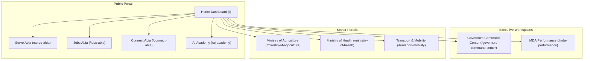

# Information Architecture Map

## Existing Architecture Hierarchy

## Architecture Review
- **Misplaced Pages:** Informational pages like `/digital-archives-heritage` contain executive dashboard widgets.
- **Orphan Pages:** Several deconflicted route variants (e.g. `/serve-abia-2`) are unreachable from standard navigation, but accessible via the Directory.
- **Hierarchy Breakdown:** Suffix page names (like `-2`, `-3`) create a flat route system instead of nested folder structures.
